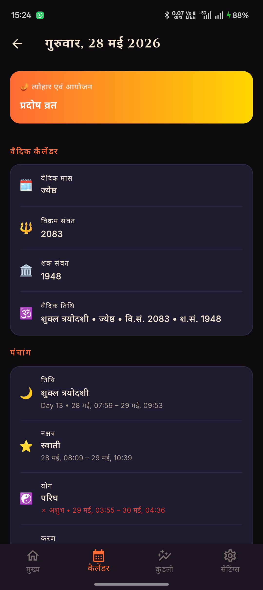
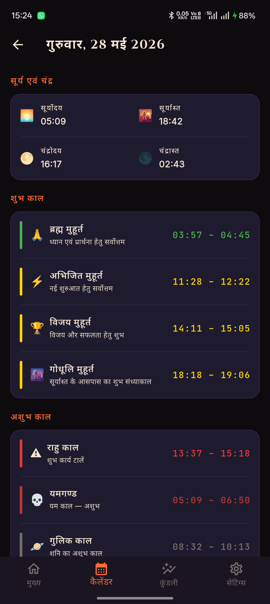
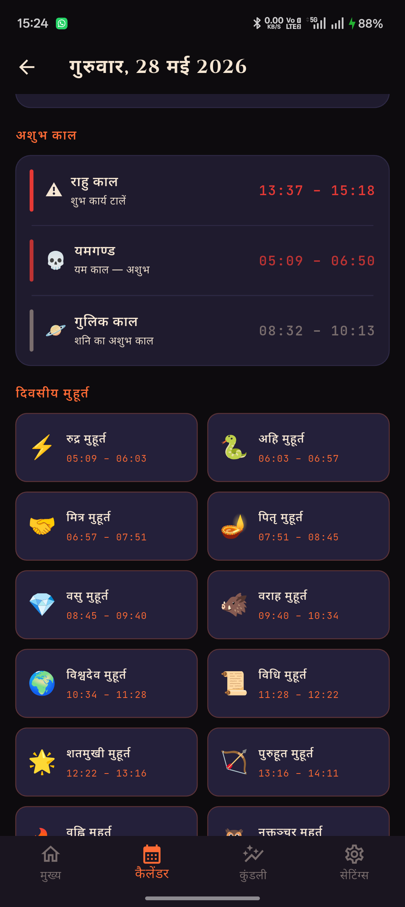
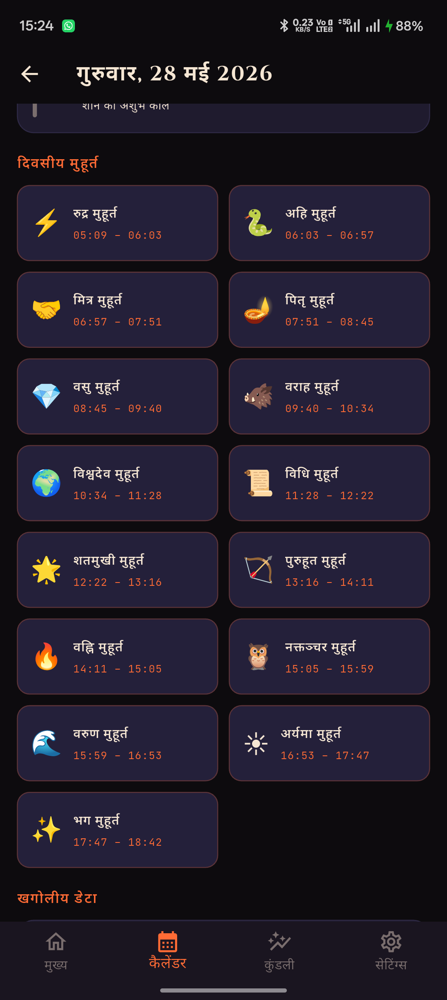

# Vedic Panchang

A production-grade Android app for Vedic Panchang calculations, Kundali (horoscope), Choghadiya, Hora, and Hindu festival calendar. Built entirely with Kotlin and Jetpack Compose.

## Screenshots

| Home | Calendar | Horoscope | Settings |
|------|----------|-----------|----------|
|  |  |  |  |

## Features

### Panchang (Daily Details)
- Tithi, Nakshatra, Yoga, Karana, Vara
- Sunrise and sunset times
- Sun and Moon positions
- Auspicious and inauspicious time windows

### Choghadiya & Hora
- Day and night Choghadiya periods with quality ratings
- Planetary Hora table for the full day

### Horoscope / Kundali
- Birth chart generation (North Indian and South Indian chart styles)
- Planetary positions table with degrees and retrograde status
- Vimshottari Dasha tree (Maha, Antar, Pratyantar)
- Navamsha (D9) divisional chart
- One-tap share as image

### Calendar
- Monthly Vedic calendar view with Tithi overlays
- Tap any date to see full-day Panchang details
- Personal notes attached to calendar dates (stored locally via Room)
- Upcoming Hindu festivals and events card

### Widget
- Home-screen Panchang widget showing today's key details

### Notifications
- Scheduled daily Panchang reminders (survives device reboots via `BootReceiver`)

### Settings
- Language: English / Hindi / Sanskrit
- Chart style: North Indian / South Indian
- Dark / Light theme
- Notification toggle and time picker
- In-app help guide

## Tech Stack

| Layer | Technology |
|-------|-----------|
| Language | Kotlin 2.3.21 |
| UI | Jetpack Compose + Material 3 |
| Architecture | MVVM (ViewModel + StateFlow) |
| DI | Hilt 2.59.2 |
| Navigation | Navigation Compose 2.8.9 |
| Local DB | Room 2.7.1 |
| Preferences | DataStore |
| Astronomy engine | Kotlin Multiplatform module (`astronomy`) |
| Location | Google Play Services Location |
| Fonts | Google Fonts via Compose |
| Build | Gradle 9.4.1, AGP 9.2.1, JDK 21 |

## Project Structure

```
VedicPanchang/
├── app/                         # Android application module
│   └── src/main/kotlin/in/vedicpanchang/app/
│       ├── data/
│       │   ├── datasource/      # AppPreferences (DataStore), Room DB (NoteDao, NoteEntity)
│       │   ├── model/           # UI data models (PanchangModel, HoroscopeModel, etc.)
│       │   └── FestivalData.kt  # Static Hindu festival dataset
│       ├── di/
│       │   └── AppModule.kt     # Hilt module bindings
│       ├── l10n/                # Localization helpers (English / Hindi / Sanskrit)
│       ├── receiver/            # BootReceiver, NotificationReceiver
│       ├── service/             # PanchangService, HoroscopeService, LocationService,
│       │                        # NotificationScheduler, ShareService, WidgetService
│       ├── ui/
│       │   ├── animation/       # Motion tokens for screen transitions
│       │   ├── calendar/        # CalendarScreen
│       │   ├── daydetail/       # DayDetailScreen
│       │   ├── home/            # HomeScreen + cards (Choghadiya, Hora, SunMoon, etc.)
│       │   ├── horoscope/       # HoroscopeScreen, NorthIndianChart, SouthIndianChart,
│       │   │                    # DashaSection, NavamshaSection, PlanetPositionsTable
│       │   ├── navigation/      # NavGraph, NavRoutes, AppBottomNav
│       │   ├── settings/        # SettingsScreen, HelpScreen
│       │   └── theme/           # AppColors, AppTextStyles, AppTheme
│       ├── viewmodel/           # PanchangViewModel, HoroscopeViewModel,
│       │                        # CalendarViewModel, SettingsViewModel
│       └── widget/              # PanchangWidgetProvider
├── astronomy/                   # Kotlin Multiplatform calculation engine
│   └── src/commonMain/kotlin/in/vedicpanchang/astronomy/
│       ├── AstronomyService.kt      # Top-level facade
│       ├── PanchangCalculators.kt   # Tithi, Nakshatra, Yoga, Karana
│       ├── PanchangConstants.kt     # Astronomical constants
│       ├── PlanetaryPositions.kt    # Planetary longitude calculations
│       ├── ChoghadiyaCalculator.kt  # Choghadiya periods
│       ├── HoraCalculator.kt        # Hora periods
│       ├── MuhurtaCalculator.kt     # Auspicious windows
│       └── TimeRange.kt             # Time interval model
├── images/                      # App screenshots
├── keys/                        # Signing keystore and key.properties (not committed)
├── specs/                       # Feature specification documents
├── gradle/
│   ├── libs.versions.toml       # Version catalog
│   └── wrapper/                 # Gradle wrapper
├── build.gradle.kts             # Root build file
├── settings.gradle.kts          # Module includes
├── gradle.properties
├── AGENTS.md                    # AI agent workflow guide
└── README.md
```

## Getting Started

### Prerequisites

- Android Studio Meerkat or later
- JDK 21 (configured via Gradle toolchain)
- Android SDK with API 37 installed

### Build (debug)

```bash
# macOS / Linux
./gradlew assembleDebug

# Windows
.\gradlew.bat assembleDebug
```

Install directly to a connected device or emulator:

```bash
./gradlew installDebug
```

### Run unit tests

```bash
./gradlew test
```

## Building a Production Release

### 1. Set up signing

Create `keys/key.properties` (this file must not be committed to version control):

```properties
storeFile=upload-keystore.jks
storePassword=<your-store-password>
keyAlias=<your-key-alias>
keyPassword=<your-key-password>
```

Place the matching keystore file at `keys/upload-keystore.jks`.

> The build script will throw a `GradleException` if either file is missing when building a release variant.

### 2. Build a signed APK

```bash
./gradlew assembleRelease
```

Output: `app/build/outputs/apk/release/app-release.apk`

### 3. Build a signed AAB (for Google Play)

```bash
./gradlew bundleRelease
```

Output: `app/build/outputs/bundle/release/app-release.aab`

### Release build optimizations

The release build type enables:
- **R8 code shrinking** (`isMinifyEnabled = true`)
- **Resource shrinking** (`isShrinkResources = true`)
- ProGuard rules from `app/proguard-rules.pro`

### Version bump

Edit `app/build.gradle.kts`:

```kotlin
defaultConfig {
    versionCode = 2          // increment for every Play Store upload
    versionName = "2.0.2"   // human-readable version shown in the app
}
```

## Localization

The app ships with three languages selectable at runtime:

| Language | Resource directory |
|----------|--------------------|
| English  | `values/` (default) |
| Hindi    | `values-hi/` |
| Sanskrit | `values-sa/` |

String resolution is handled in `l10n/AppStrings.kt`. To add a new language, create the corresponding `values-<lang>/strings.xml` and add the locale option to `SettingsScreen`.

## Specification-Driven Development

All feature work starts with a written spec in `specs/`. See **AGENTS.md** for the full workflow. Each spec follows this template:

```markdown
# Spec: <short title>
Status: Draft | Approved | Implemented

## Goal
## Non-goals
## Context
## Design
## Acceptance criteria
## Test plan
## Rollout / compatibility
```

## Contributing

1. Write a spec in `specs/` and get it approved before coding.
2. Link every commit and PR back to its spec.
3. Keep acceptance criteria up to date as the implementation evolves.
4. Update this README if behavior visible to users changes.
